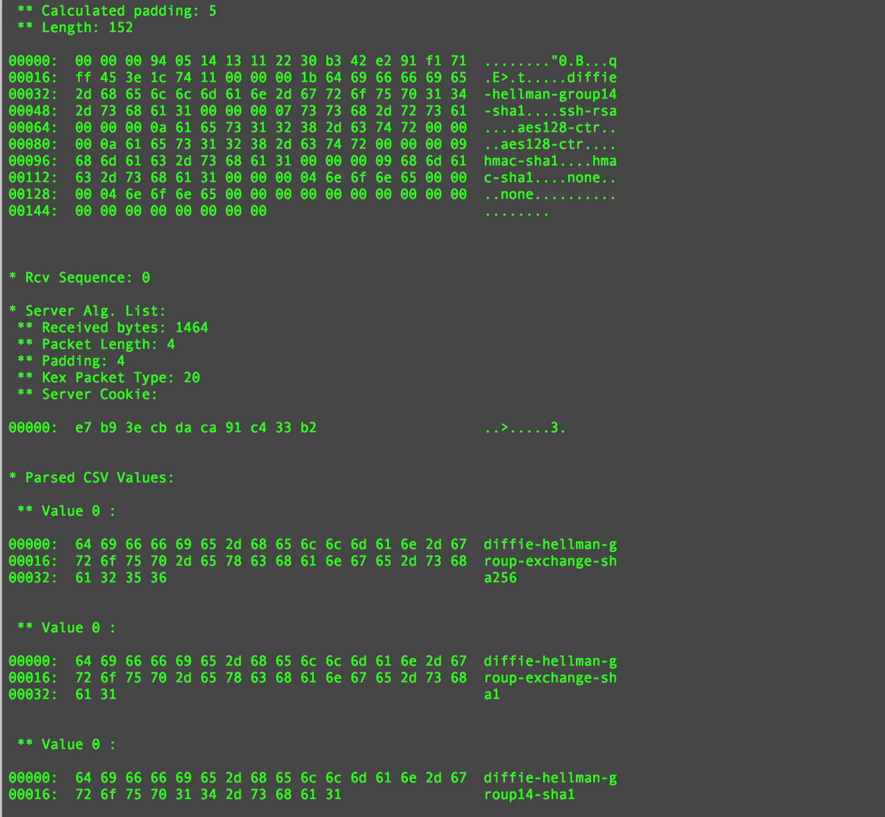

Description:
============

Tssh is a SSH 2 client I wrote in C++11 (now updated to C++20) from scratch, starting from the RFCs.

Debug mode can print for every packet sent a detailed dump, with a description of their purpose. This is a screeshoot of the output that the program produces in debug mode, with the contents of the initial packets exchange:



FEATURES:
=========

This alpha version implements the basic functions to connect the client to a remote SSH2 server, opening an iteractive shell, with or without an allocated pty.

At the moment, only few cryptographic algorithms are implemented:

- Kex: diffie-hellman-group14-sha1 (rsa-sha and rsa-sha2-256 2048 bits), diffie-hellman-group14-sha256;
- Block encryption: AES 128 bits (aes128-ctr);
- HMAC: hmac-sha1, hmac-sha2-256;

That provides the base to connect to all the reasonably modern server configurations.

Prerequisites:
==============

The program is intended to be used in a *nix environment and it is tested on various Linux distributions and OS X:

- Ubuntu 22.04.2 LTS  ARM
- Ubuntu 22.04.4 LTS  X86-64
- MacOS  13.6.7       ARM 
- MAcOS  12.6.8       X86-64

using, as compiler, one in this list:

- gcc version 9.3.0 (Ubuntu 9.3.0-17ubuntu1~20.04)
- gcc version 11.4.0 (Ubuntu 11.4.0-1ubuntu1~22.04) 
- Apple clang version 14.0.3 (clang-1403.0.22.14.1)
- Apple clang version 15.0.0 (clang-1500.1.0.2.5)

and, as ssh server, one of the following:

- OpenSSH_8.9p1  Ubuntu 22.04.2 LTS                 ARM
- OpenSSH_9.0p1, LibreSSL 3.3.6  MacOs  13.5        ARM
- OpenSSH_8.6p1, LibreSSL 3.3.6  MacOs  12.6.8      x86_64
- OpenSSH_8.9p1 Ubuntu-3ubuntu0.3, OpenSSL 3.0.2 15 x86_64
- OpenSSH_8.9p1 Ubuntu-3ubuntu0.7, OpenSSL 3.0.2 15 ARM      

The only external dependency is the OpenSSL library, used for the cryptographic functions.
I could introduce alternatives to OpenSSL in the next versions.
This program is intended to be used with an OpenSSL version equal or superior to:

- OpenSSL 3.0.10 LTS

tested  with:

- OpenSSL 3.0.10 LTS

( This means that with OS X, an upgrade is mandatory).

To compile the program, this tools/libraries are necessary:

- a c++ compiler ( with c++11 support);
- automake/autoconf;
- libtool;
- OpenSSL 3.0.10 ("dev" packages) 

Legacy Version:
===============

To compile this software with the old OpenSSL versiona 1.0.x, use the CryptoImpl.cpp in the 'legacy' directory, replacing the one present in the 'src' directory and the configure.ac file present in the root directory with the one available in the 'legacy' directory.

The old version was tested in the following OSs:

- RHEL7 Linux  x86_64;
- Debian 7 ("wheezy");
- Ubuntu 16.04 LTS;
- Ubuntu 14.04 LTS;
- OS X 10.10.5;
- OS X 10.15.7;

with these compilers:

- Apple clang version 12.0.0 (clang-1200.0.32.29)
- clang version 4.0.0;
- clang version 3.8.1;
- gcc version 4.8.5 20150623 (Red Hat 4.8.5-4) (GCC);
- gcc version 4.8.4 (Ubuntu 4.8.4-2ubuntu1~14.04.3);
- gcc version 4.7.2 (Debian 4.7.2-5);
- Apple LLVM version 6.0 (clang-600.0.57) (based on LLVM 3.5svn)

and this OpenSSL version:

- OpenSSL 1.0.2h;

and, as ssh server, one of the following:

- OpenSSH_6.0p1
- OpenSSH_6.2p2
- OpenSSH_6.6.1p1
- OpenSSH_7.2p2
- OpenSSH_8.2p1 


Installation:
=============

- create compilation scripts:<BR>
  make -f makefile.dist
- launch the configure script:<BR>
  ./configure
- Compile the program:<BR>
  make
- Install the program and the man page:<BR>
  sudo make install

Instructions:
=============

See the man page included in the release.

Key creation: rsa-sha2-256 
==========================

OpenSSH introduced a new default proprietary format for DH keys, that is not supported by this program, that, instead use the standard PEM format.
This means that when you create the SSH keys, you need to add an extra parameter when you create a rsa-sha2-256 key pair, for example:
```shell
ssh-keygen -t rsa-sha2-256 -b 2048 -m PEM
```
Connection example (server is configured to use port 2222):
```shell
./tssh  -i id_rsa -l bg -p2222 192.168.1.13
```
See man page for further details.

Important Notes:
================

At the moment I consider this program an instrument to study the SSH internals and a base for some security test applications.
This program is an alpha version and, at the moment, it's considered experimental. In particular, it doesn't represent an alternative to consolidated program like the OpenSSH client: the programmers of that tool (and its equivalents ) implemented plenty of security features that, at the moment, are not present in my program. So keep in mind that in some situation the use of this software should be avoided.

Note that the "-d" flag will print on stderr all the packets exchanged before and after the authentication, and the current status of the client. 

*** This means that sensible data will be visualized on the screen ! *** 

So if you are thinking to use this program in environment with security restrictions,  reflect on the consequences before using it!


